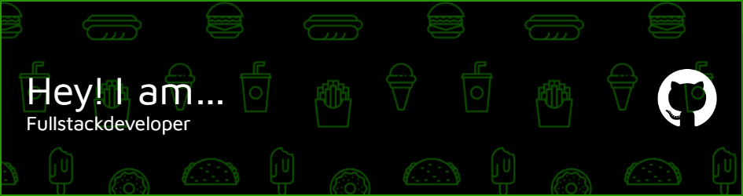

## About Me
I am a passionate and experienced Full Stack Developer with a strong focus on creating efficient, scalable, and maintainable web applications. I enjoy working on challenging projects and turning ideas into reality through code. I strive to continuously learn and improve my skills to stay up-to-date with the latest technologies and industry trends.

## Skills
- **Frontend:** HTML, CSS, JavaScript, React
- **Backend:** Node.js, Php
- **Database:** MongoDB, MySQL, PostgreSQL
- **DevOps:** Git, Docker, AWS
- **Testing:** Jest, Mocha, Chai
- **Others:** RESTful APIs, GraphQL, Responsive Design, UI/UX

## Contact Me
- LinkedIn: [Your LinkedIn Profile](https://www.linkedin.com/in/omer-karacay)
- Email: omer@omerkaracay.md
- Website: [Your Website](https://omerkaracay.md)

Feel free to reach out to me for any collaboration, project ideas, or inquiries. I'm open to exciting opportunities and always ready to discuss new projects!

